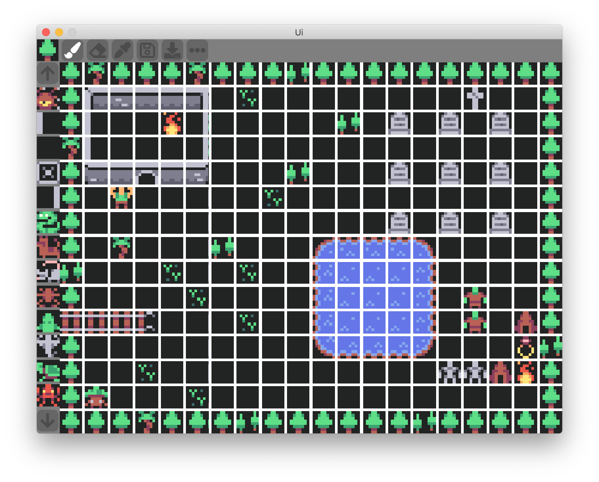

# TileSet Editor (Love2d)

This is in fact a UI framework, this editor is just a demo of of what this ui tool kit can do

**Why is it not written in lua ?**

As you can see, This project is written in typescript not in lua.
For my mental health I have stopped working with non typed language.
As I cant remember which type each variable is supposed to be. I have two options : 
 1. let the runtime tell me I have made a mistake by giving a table instead of a number at line 345 of demo.lua (which I may or may not have written)
 2. add a compilator to check for me.  



To load this map copy in your clipboard and click on the load icon 
```json
[{"y":5,"x":5},{"y":5,"x":7},{"y":5,"x":5},{"y":5,"x":5},{"y":5,"x":5},{"y":5,"x":7},{"y":5,"x":5},{"y":5,"x":5},{"y":5,"x":5},{"y":5,"x":6},{"y":5,"x":5},{"y":5,"x":5},{"y":5,"x":5},{"y":5,"x":5},{"y":5,"x":5},{"y":5,"x":5},{"y":5,"x":5},{"y":5,"x":5},{"y":5,"x":5},{"y":5,"x":5},{"y":5,"x":5},{"y":0,"x":0},{"y":4,"x":2},{"y":0,"x":1},{"y":0,"x":1},{"y":4,"x":1},{"y":1,"x":1},{"y":4,"x":5},{"y":1,"x":1},{"y":1,"x":1},{"y":1,"x":1},{"y":1,"x":1},{"y":1,"x":1},{"y":1,"x":1},{"y":1,"x":1},{"y":1,"x":1},{"y":7,"x":8},{"y":1,"x":1},{"y":1,"x":1},{"y":5,"x":5},{"y":5,"x":5},{"y":1,"x":0},{"y":1,"x":1},{"y":1,"x":1},{"y":8,"x":8},{"y":1,"x":3},{"y":1,"x":1},{"y":1,"x":1},{"y":1,"x":1},{"y":1,"x":1},{"y":1,"x":1},{"y":5,"x":6},{"y":1,"x":1},{"y":7,"x":9},{"y":1,"x":1},{"y":7,"x":9},{"y":1,"x":1},{"y":7,"x":9},{"y":1,"x":1},{"y":5,"x":5},{"y":5,"x":7},{"y":1,"x":0},{"y":1,"x":1},{"y":1,"x":1},{"y":1,"x":1},{"y":1,"x":3},{"y":1,"x":1},{"y":1,"x":1},{"y":1,"x":1},{"y":1,"x":1},{"y":1,"x":1},{"y":1,"x":1},{"y":1,"x":1},{"y":1,"x":1},{"y":1,"x":1},{"y":1,"x":1},{"y":1,"x":1},{"y":1,"x":1},{"y":1,"x":1},{"y":5,"x":5},{"y":5,"x":5},{"y":5,"x":2},{"y":0,"x":1},{"y":0,"x":2},{"y":0,"x":1},{"y":5,"x":3},{"y":1,"x":1},{"y":1,"x":1},{"y":1,"x":1},{"y":5,"x":6},{"y":1,"x":1},{"y":1,"x":1},{"y":1,"x":1},{"y":7,"x":9},{"y":1,"x":1},{"y":7,"x":9},{"y":1,"x":1},{"y":7,"x":9},{"y":1,"x":1},{"y":5,"x":5},{"y":5,"x":5},{"y":1,"x":1},{"y":0,"x":7},{"y":1,"x":1},{"y":1,"x":1},{"y":1,"x":1},{"y":1,"x":1},{"y":1,"x":1},{"y":4,"x":5},{"y":1,"x":1},{"y":1,"x":1},{"y":1,"x":1},{"y":1,"x":1},{"y":1,"x":1},{"y":1,"x":1},{"y":1,"x":1},{"y":1,"x":1},{"y":1,"x":1},{"y":1,"x":1},{"y":5,"x":5},{"y":5,"x":5},{"y":1,"x":1},{"y":1,"x":1},{"y":1,"x":1},{"y":1,"x":1},{"y":1,"x":1},{"y":1,"x":1},{"y":1,"x":1},{"y":1,"x":1},{"y":1,"x":1},{"y":1,"x":1},{"y":1,"x":1},{"y":1,"x":1},{"y":7,"x":9},{"y":1,"x":1},{"y":7,"x":9},{"y":1,"x":1},{"y":7,"x":9},{"y":1,"x":1},{"y":5,"x":5},{"y":5,"x":5},{"y":1,"x":1},{"y":5,"x":7},{"y":1,"x":1},{"y":1,"x":1},{"y":1,"x":1},{"y":5,"x":6},{"y":1,"x":1},{"y":1,"x":1},{"y":1,"x":1},{"y":7,"x":11},{"y":7,"x":12},{"y":7,"x":12},{"y":7,"x":12},{"y":7,"x":13},{"y":1,"x":1},{"y":1,"x":1},{"y":1,"x":1},{"y":1,"x":1},{"y":5,"x":5},{"y":5,"x":6},{"y":1,"x":1},{"y":1,"x":1},{"y":1,"x":1},{"y":4,"x":5},{"y":1,"x":1},{"y":1,"x":1},{"y":4,"x":5},{"y":1,"x":1},{"y":1,"x":1},{"y":8,"x":11},{"y":8,"x":12},{"y":8,"x":12},{"y":8,"x":12},{"y":8,"x":13},{"y":1,"x":1},{"y":1,"x":1},{"y":1,"x":1},{"y":1,"x":1},{"y":5,"x":5},{"y":5,"x":5},{"y":1,"x":1},{"y":1,"x":1},{"y":1,"x":1},{"y":1,"x":1},{"y":4,"x":5},{"y":1,"x":1},{"y":1,"x":1},{"y":1,"x":1},{"y":1,"x":1},{"y":8,"x":11},{"y":8,"x":12},{"y":8,"x":12},{"y":8,"x":12},{"y":8,"x":13},{"y":1,"x":1},{"y":0,"x":11},{"y":1,"x":1},{"y":1,"x":1},{"y":5,"x":5},{"y":2,"x":12},{"y":2,"x":12},{"y":2,"x":12},{"y":2,"x":13},{"y":1,"x":1},{"y":1,"x":1},{"y":1,"x":1},{"y":4,"x":5},{"y":1,"x":1},{"y":1,"x":1},{"y":8,"x":11},{"y":8,"x":12},{"y":8,"x":12},{"y":8,"x":12},{"y":8,"x":13},{"y":1,"x":1},{"y":0,"x":11},{"y":1,"x":1},{"y":7,"x":7},{"y":5,"x":5},{"y":5,"x":5},{"y":1,"x":1},{"y":1,"x":1},{"y":1,"x":1},{"y":1,"x":1},{"y":1,"x":1},{"y":1,"x":1},{"y":1,"x":1},{"y":1,"x":1},{"y":1,"x":1},{"y":9,"x":11},{"y":9,"x":12},{"y":9,"x":12},{"y":9,"x":12},{"y":9,"x":13},{"y":1,"x":1},{"y":1,"x":1},{"y":1,"x":1},{"y":5,"x":9},{"y":5,"x":6},{"y":5,"x":5},{"y":1,"x":1},{"y":1,"x":1},{"y":4,"x":5},{"y":1,"x":1},{"y":1,"x":1},{"y":1,"x":1},{"y":1,"x":1},{"y":1,"x":1},{"y":1,"x":1},{"y":1,"x":1},{"y":1,"x":1},{"y":1,"x":1},{"y":1,"x":1},{"y":1,"x":1},{"y":0,"x":10},{"y":0,"x":10},{"y":7,"x":7},{"y":8,"x":8},{"y":5,"x":5},{"y":5,"x":5},{"y":1,"x":12},{"y":1,"x":1},{"y":1,"x":1},{"y":1,"x":1},{"y":4,"x":5},{"y":1,"x":1},{"y":1,"x":1},{"y":1,"x":1},{"y":1,"x":1},{"y":1,"x":1},{"y":1,"x":1},{"y":1,"x":1},{"y":1,"x":1},{"y":1,"x":1},{"y":1,"x":1},{"y":1,"x":1},{"y":1,"x":1},{"y":1,"x":1},{"y":5,"x":5},{"y":5,"x":5},{"y":5,"x":5},{"y":5,"x":5},{"y":5,"x":7},{"y":5,"x":5},{"y":5,"x":5},{"y":5,"x":5},{"y":5,"x":6},{"y":5,"x":5},{"y":5,"x":5},{"y":5,"x":5},{"y":5,"x":5},{"y":5,"x":5},{"y":5,"x":5},{"y":5,"x":6},{"y":5,"x":5},{"y":5,"x":5},{"y":5,"x":5},{"y":5,"x":5},{"y":5,"x":5}]
```

## Demo Usage

### Setup
- `npm install`
- Have LOVE installed in path

### Running
- `npm run start`

### Packing for sending 
- `npm run pack`


## Ui toolkit Documentation

There is 3 main part of this Ui tool kit : 

 1. Frame: This is the core of the toolkit. Which holds the frame, the layout and the hierachie. This is a standalone lib which depend on nothing
 2. Painter: The `Frame` part does not render any thing but ask for `Painter` function to render its content. It allow you a lot of controle on how you want to draw stuff. This part of the lib contain basic painter like text, image and tiles
 3. Ui: This part add interactivity class which lack from `Frame`.


So to summeraize you have three part : layout, painting and interaction. 


### `Frame`

Any Ui is represented based on a tree of `frame`. Each frame has a parent (up to the main window) and has children. 

Each Frame hold those properties : 

- `Postion` : Hold the position of the frame Can be  : 
  - `FixedPosition`  : set `X` and `Y` relative to his parent  
  - `AnchoredPosition` : to set behavior like center in parent
  - `LayoutPosition` :  his parent will decide where to place is (Use `Row`,`Column` or `Grid`)
- `Size` : hold the size of the frame. Only fixed for now but may be stretch in the future
- `Layout` : what to do which your children ? 
	- `NoChildLayout` : let them be where they wand
	- `ColumnLayout` : fixe their position to be drawn in a column
	- `RowLayout` : fixe their position to be drawn in a row
	- `GridLayout` : fixe their position to be drawn in a grid (you must specifiy the number of columns)
- `PainterFunction`: pick one of the pre-existing from the `Painter` or write one yourselfe
- `OnPress|OnRelease` : start building interactive widget by implementing this funtion


**Example**

```typescript
	let toolbar:Frame = new Frame(
		new FixedPosition(0,0),
		new Size(800,50),
		window,
		new RowLayout(5),
		RectanglePainter(Colors.Gray)
	)
	for(let i:number=0;i<5;i++){
		new Frame(
			new LayoutPosition(),
			new Size(48,48),
			toolbar,
			new NoChildLayout(),
			TilePainter(tilemap,new Tile(1,2)),
		)
	}
```

### `Painter`

The paint function signature : 

```typescript
export type PaintFunction = (x:number,y:number,width:number,height:number)=>void;
```

When drawing your frame, its paint function will be called with global cordinate and size 
You cand do anything you want in there. 

There is already few function writte to help you start : 

- `Rectangle` : to draw  a rectangle of color 
- `Image` : to draw  a streched version of the provided image 
- `NinePatchImage` : Mainly use for button and panel this allow you to stretch you image witouth distroding edges
- `Label` : to write text
- `Tile`: allw you to draw one tile of a tileset or an entire tilemap. 
- `Group`: Want to draw more than one thing in your frame ! Use a group to call several Paint function 

**Example**

```typescript
export function RectanglePainter(c:Color,rouned:number=0) :PaintFunction{
	return (x:number,y:number,width:number,height:number)=>{
		love.graphics.setColor(c.r,c.g,c.b,255)
		love.graphics.rectangle("fill",x,y,width,height,rouned,rouned)
	}
}
```

### `Ui`

Its is mainly here for illustration purpose 
You can find a button implementation with a button group


## RoadMap

Here you can fork this repo and add anything you want.
There is not so much code so this should be easy enough. 

I have some idea of what I can add like 

- streching behavious in `frame`
- add a tab layout behavior
- improve image painter with keep aspect ratio, strech, center...
- improve label painter with more alignment feature ... 
- adding tween for animation
- add unit test

What I will not do : 

 - Adding a bunch of pre made Ui widget like : radio, checkbox, input, .... 
 - Working on performance
 - Writing it in lua 


